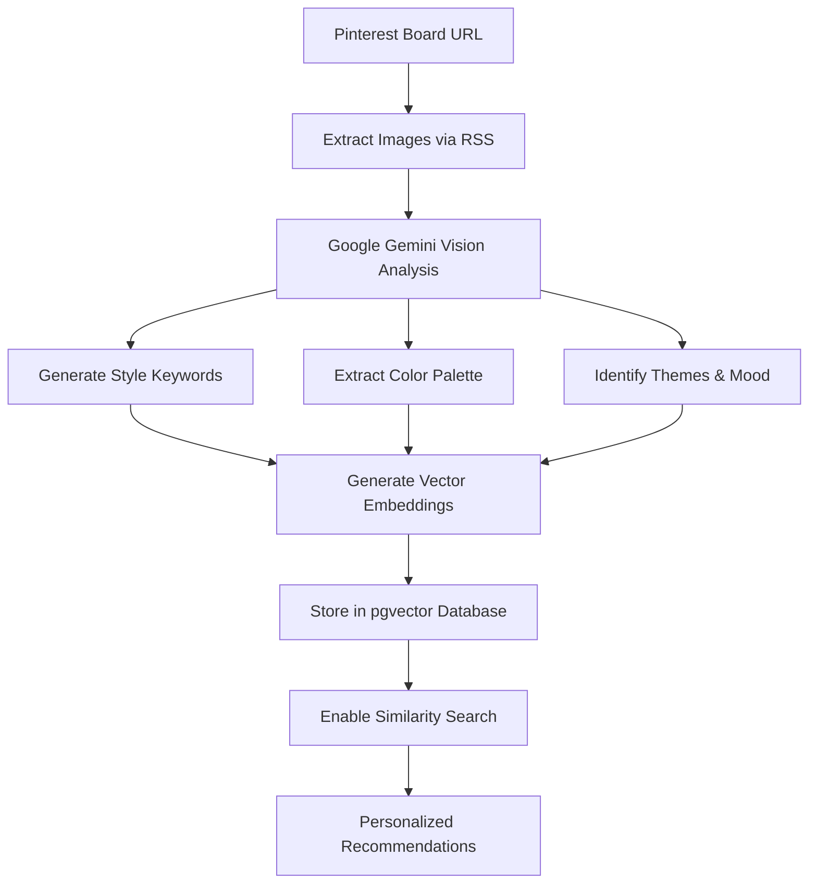

# 🎨 Flai - AI-Powered Style Analysis Platform

An intelligent style analysis platform built with React Native Expo and FastAPI, featuring AI-powered Pinterest board analysis, vector similarity search, and personalized style recommendations.

## ✨ Features

- **📱 Phone Authentication**: Secure SMS-based authentication flow
- **🎨 Pinterest Analysis**: AI-powered analysis of Pinterest boards using Google Gemini Vision
- **🔍 Vector Search**: Advanced similarity search using pgvector embeddings
- **💅 Style Recommendations**: Personalized style suggestions based on analyzed images
- **📊 Real-time Profile**: Dynamic user profiles with style preferences
- **🔄 Live Updates**: Update Pinterest boards with automatic re-analysis

## 🏗️ Architecture

- **Frontend**: React Native Expo (iOS & Android)
- **Backend**: Python FastAPI with async support
- **Database**: Supabase (PostgreSQL) with pgvector for embeddings
- **AI/ML**: Google Gemini Vision API + LangChain for image analysis
- **Authentication**: Supabase Auth with phone number verification
- **Monorepo**: Turborepo with PNPM workspaces

## 📁 Project Structure

```
flai/
├── 📱 apps/
│   ├── mobile/          # React Native Expo app
│   │   ├── src/features/
│   │   │   ├── auth/           # Authentication flow
│   │   │   ├── dashboard/      # Main app screens
│   │   │   └── landing/        # Landing page
│   │   └── app/               # Expo Router navigation
│   └── api/             # Python FastAPI backend
│       ├── app/
│       │   ├── routers/        # API endpoints
│       │   ├── services/       # Business logic
│       │   ├── models/         # Database models
│       │   └── config/         # Configuration
│       └── supabase/          # Database migrations
├── 📚 packages/
│   ├── eslint-config/   # ESLint configuration
│   └── typescript-config/ # TypeScript configuration
├── docker-compose.yml   # Local development services
└── turbo.json          # Turborepo configuration
```

## 🚀 Quick Start

### Prerequisites

- Node.js 18+ and PNPM
- Python 3.11+
- Docker and Docker Compose (for local database)
- Expo CLI (`npm install -g @expo/cli`)
- Supabase account (for authentication and database)
- Google AI API key (for image analysis)

### 1. Install Dependencies

```bash
# Install all dependencies
pnpm install

# Install Python dependencies for API
cd apps/api
pip install -r requirements.txt
cd ../..
```

### 2. Environment Setup

Create environment files (these are blocked by .gitignore for security):

**Root `.env`:**
```bash
# Supabase Configuration
SUPABASE_URL=your_supabase_project_url
SUPABASE_SERVICE_ROLE_KEY=your_supabase_service_role_key

# Google AI Services
GOOGLE_API_KEY=your_google_gemini_api_key
```

**Mobile app `.env` (apps/mobile/.env):**
```bash
EXPO_PUBLIC_API_URL=http://192.168.1.XXX:8000
EXPO_PUBLIC_SUPABASE_URL=your_supabase_project_url
EXPO_PUBLIC_SUPABASE_ANON_KEY=your_supabase_anon_key
```

### 3. Database Setup

```bash
# The app uses Supabase - no local database setup required
# Migrations are automatically applied via Supabase
```

### 4. Start Development Services

```bash
# Start the entire development environment
pnpm dev

# Or start services individually:
pnpm dev:mobile    # React Native Expo
pnpm dev:api       # FastAPI backend
```

### 5. Access Applications

- **Mobile App**: Expo Go app or web browser at `http://localhost:8081`
- **API Documentation**: `http://localhost:8000/docs`
- **API Health Check**: `http://localhost:8000/health`

## 📱 Authentication Flow

The app uses a progressive onboarding flow designed for style enthusiasts:

```
📞 Phone Entry → 🔐 OTP Verification → 👋 Welcome → 👤 Username → 📌 Pinterest → 🏠 Dashboard
```

### 1. **Phone Authentication**
- Enter phone number with country code
- Receive SMS verification code
- Supabase Auth handles secure authentication

### 2. **Welcome Screen**
- Introduction to Flai's style analysis features
- Brief overview of Pinterest integration

### 3. **Username Selection**
- Choose unique username (@username)
- Real-time availability checking
- Creates user profile in database

### 4. **Pinterest Board Analysis**
- Enter Pinterest board URL (username/boardname format)
- AI-powered analysis using Google Gemini Vision
- Extracts style keywords, colors, themes, and mood
- Generates vector embeddings for each image
- Links Pinterest board to user profile (separate operation)

### 5. **Onboarding Completion**
- Marks onboarding as complete (platform-agnostic)
- User gains access to dashboard and full app features
- Separated from platform linking for future extensibility

## 🤖 AI & Machine Learning Features

### Pinterest Board Analysis
- **Image Processing**: Automatic image extraction from Pinterest RSS feeds
- **Vision AI**: Google Gemini Vision API analyzes visual content
- **Style Extraction**: Identifies aesthetic elements, colors, themes, and moods
- **Confidence Scoring**: Provides analysis confidence metrics

### Vector Embeddings & Search
- **Image Embeddings**: 768-dimensional vectors using Google AI
- **Text Embeddings**: Style descriptions and keywords
- **Similarity Search**: pgvector-powered search for similar images
- **Recommendation Engine**: Personalized suggestions based on style vectors

### Supported Analysis
- **Aesthetic Description**: AI-generated overall style description
- **Style Keywords**: Categorized style elements (modern, minimalist, etc.)
- **Color Palette**: Dominant colors in the analyzed images
- **Themes & Moods**: Emotional and thematic content analysis

## 🛠️ Development Commands

```bash
# Development
pnpm dev              # Start all apps
pnpm dev:mobile       # Start mobile app only  
pnpm dev:api          # Start API only

# Building
pnpm build            # Build all apps
pnpm build:mobile     # Build mobile app

# Linting & Type Checking
pnpm lint             # Lint all code
pnpm check-types      # Type check all TypeScript

# Mobile specific
cd apps/mobile && npx expo run:ios     # Run on iOS simulator
cd apps/mobile && npx expo run:android # Run on Android emulator

# API specific
cd apps/api && python main.py         # Start API directly
```

## 🔧 Technology Stack

### Frontend (React Native Expo)
- **Framework**: Expo SDK 50+
- **Navigation**: Expo Router (file-based routing)
- **Authentication**: Supabase Auth (phone verification)
- **UI Components**: Custom styled components
- **State Management**: React Context + useAuth hook
- **HTTP Client**: Fetch API

### Backend (Python FastAPI)
- **Framework**: FastAPI with async/await
- **Database**: Supabase PostgreSQL with pgvector
- **ORM**: Raw SQL with SQLAlchemy for connection management
- **AI/ML**: LangChain + Google Generative AI
- **Image Processing**: Google Gemini Vision API
- **Vector Operations**: pgvector for similarity search

### Database & Storage
- **Primary DB**: Supabase (PostgreSQL 15)
- **Vector Extension**: pgvector for embedding storage
- **Authentication**: Supabase Auth with phone verification
- **Hosting**: Supabase cloud infrastructure

### Key Data Models
```sql
-- User authentication (managed by Supabase Auth)
auth.users (id, phone, created_at)

-- User profiles (app-specific data)
user_profiles (id, username, phone_number, onboarding_completed, pinterest_board_analyzed)

-- Analyzed images with vector embeddings
analyzed_images (id, user_id, image_url, image_embedding, style_embedding, 
                detected_styles, detected_colors, dominant_mood, aesthetic_score)
```

## 📊 API Endpoints

### Authentication & Users
- `GET /api/v1/users/profile/{user_id}` - Get user profile
- `POST /api/v1/users/profile` - Create user profile
- `POST /api/v1/users/profile/{user_id}/complete-onboarding` - Complete onboarding (platform-agnostic)
- `POST /api/v1/users/profile/{user_id}/pinterest-board` - Link/update Pinterest board

### Pinterest Analysis
- `POST /api/v1/pinterest/analyze-board` - Analyze Pinterest board
- `GET /api/v1/pinterest/analyzed-images/{user_id}` - Get user's analyzed images

### Utility
- `GET /health` - Health check

## 🎨 Style Analysis Pipeline



## 🚢 Deployment

### Mobile App (Expo)
```bash
# Build for production
cd apps/mobile
npx expo build:ios     # iOS App Store
npx expo build:android # Google Play Store

# Or use EAS Build (recommended)
npx eas build --platform ios
npx eas build --platform android
```

### API Backend
```bash
# The API is designed to deploy to any Python hosting platform
# Examples: Railway, Render, DigitalOcean App Platform, AWS Lambda

# Example Dockerfile is included in apps/api/
docker build -t flai-api ./apps/api
```

## 📱 Mobile App Features

### Core Screens
- **🏠 Landing**: Welcome and authentication entry point
- **📞 Phone**: Phone number entry with country code selection
- **🔐 Verify**: SMS code verification
- **👋 Welcome**: App introduction and features overview
- **👤 Username**: Username selection and profile creation
- **📌 Pinterest**: Pinterest board URL entry and analysis
- **🏠 Dashboard**: Main app with tabs (Home, Search, Cart, Profile)

### Dashboard Tabs
- **🏠 Home**: Style analysis results and recommendations
- **🔍 Search**: Vector-powered image and style search
- **🛒 Cart**: Placeholder for future e-commerce features
- **👤 Profile**: User profile management and Pinterest board updates

## 🔮 Future Enhancements

- **🛍️ E-commerce Integration**: Product recommendations based on style analysis
- **📸 Camera Integration**: Analyze photos taken with phone camera
- **🤝 Social Features**: Share style profiles and boards with friends
- **🎯 Advanced Filters**: Filter recommendations by color, style, price range
- **📈 Analytics**: Style evolution tracking over time
- **🔗 Multi-Platform**: Support for Instagram, TikTok, and other visual platforms

## 🤝 Contributing

1. Fork the repository
2. Create a feature branch (`git checkout -b feature/style-enhancement`)
3. Commit your changes (`git commit -m 'Add style enhancement'`)
4. Push to the branch (`git push origin feature/style-enhancement`)
5. Open a Pull Request

## 📄 License

This project is licensed under the MIT License - see the [LICENSE](LICENSE) file for details.

### Development Tips

**Reset user onboarding:**
```bash
# Delete user from auth.users and user_profiles tables
# User will go through onboarding flow again
```

**Test with sample Pinterest boards:**
- Use public Pinterest boards for testing
- Format: `username/boardname` or full URL

**Debug vector embeddings:**
```bash
# Use the generate-embedding endpoint to test
curl -X POST "http://localhost:8000/api/v1/pinterest/generate-embedding" \
  -H "Content-Type: application/json" \
  -d '{"text":"modern minimalist design"}'
```

For more help, open an issue or check the API documentation at `/docs`.

---

**Built with ❤️ for style enthusiasts and AI researchers**
